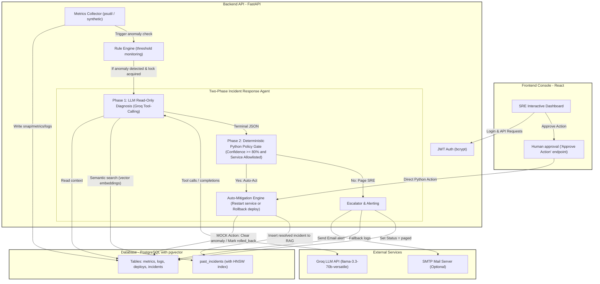

# Vigil — Autonomous Incident Response Agent with RAG-Grounded Root-Cause Reasoning

Vigil is an autonomous incident response architectural prototype. It demonstrates a **two-phase safety architecture** designed to leverage large language models (LLMs) for server monitoring and diagnostic investigation while maintaining deterministic safety guardrails.

Under abnormal conditions, Vigil executes a read-only agent loop (Phase 1) using Groq API model instances to isolate issues. It then hands off its structured diagnostic findings to a deterministic Python policy engine (Phase 2) for automated mitigation (such as simulated service restarts or rollbacks) or human escalation (SMTP/log paging).

---

## System Architecture

The following diagram illustrates Vigil's decoupled pipeline, designed to prevent LLM hallucinations from directly affecting infrastructure:



---

## Safety Design Rationale
The primary architectural goal of Vigil is the **strict separation of probabilistic reasoning from deterministic action execution**:
1. **Phase 1: LLM Investigation (Read-Only)**: The LLM is given access to strictly read-only diagnostics (`get_metrics`, `get_logs`, `get_recent_deploys`, `search_similar_incidents`). It *physically cannot* perform write actions.
2. **Phase 2: Safety Policy Gate (Deterministic)**: The LLM completes Phase 1 by returning a structured JSON containing a confidence score and recommendation. A standard Python module, completely isolated from the LLM context, evaluates this recommendation. The engine executes automated actions *only* if:
   - The LLM confidence score is >= 80%.
   - The affected service is present in the `ACTION_ALLOWLIST`.
   - The service is not `local-host` (which is blocked by policy from restarts).
3. **Operator Control**: Any investigation failing the safety checks is escalated to an SRE. The SRE reviews the LLM's diagnostic reasoning and can manually trigger the action via a dashboard request that completely bypasses the LLM.

---

## Tech Stack
- **Backend API**: FastAPI (Python 3.10), Uvicorn.
- **ORM / Database**: SQLAlchemy (Async), PostgreSQL with the `pgvector` extension and an HNSW cosine distance index.
- **Embeddings & RAG**: `sentence-transformers` (`all-MiniLM-L6-v2`) used locally to embed incident details.
- **LLM Agent**: Groq SDK (OpenAI-compatible client calling Llama 3 models) executing a function-calling loop.
- **Frontend Dashboard**: React (v19), Chart.js, Vanilla CSS.

---

## Features 
* **Background Monitoring Tick**: Regularly collects real host stats via `psutil` and generates simulated metrics for internal services (`metrics_loop.py` lines 249-311).
* **Threshold Alarm Engine**: Triggers an alert when metrics exceed thresholds (latency > 500ms, error rate > 5%, or CPU > 85%) and reserves a service-level lock (`Service.investigation_in_progress`) to block duplicate runs (`metrics_loop.py` lines 174-244).
* **AI Diagnostics Loop**: Runs a tool-calling loop using Groq LLM instances to examine server context and symptoms (`phase1_agent.py` lines 283-400).
* **Local Semantic RAG**: Matches incident symptoms to historical incidents in PostgreSQL using local sentence embeddings (`phase1_agent.py` lines 221-247).
* **Action Policy Gates**: Evaluates agent recommendations against deterministic safety allowlists (`policy_engine.py` lines 164-261).
* **Interactive SRE Console**: A web interface to view live metrics, manually inject anomalies, view incident diagnostic logs, and approve pending agent recommendations.
* **Prometheus Instrumentation**: Exposes metrics counters for route performance and incident monitoring on `/metrics` (`main.py` lines 56-61).
* **JWT Access Security**: Secures endpoints against unauthorized modifications (`auth.py`).

---

## Configuration & Environment Variables
Configure the application by copying `.env.example` to `.env` and setting:

| Env Variable | Default Value | Description |
|---|---|---|
| `DB_HOST` | `localhost` | PostgreSQL database host address |
| `DB_PORT` | `5432` | PostgreSQL database port |
| `DB_NAME` | `vigil` | PostgreSQL database name |
| `DB_USER` | `postgres` | PostgreSQL username |
| `DB_PASSWORD` | `postgres` | PostgreSQL password |
| `GROQ_API_KEY` | — | **Required**. Groq API key for LLM diagnostics |
| `GROQ_MODEL` | `llama-3.3-70b-versatile` | Model used for Phase 1 investigations |
| `AGENT_MAX_ITERATIONS` | `10` | Maximum tool-calling turns for Phase 1 |
| `ACTION_ALLOWLIST` | `checkout-api` | Comma-separated allowlist of services that can auto-mitigate |
| `JWT_SECRET` | `supersecret...` | Signing key for JWT Auth |
| `DEMO_USERNAME` | `admin` | Username for dashboard console login |
| `DEMO_PASSWORD` | `vigil2025` | Password for dashboard console login |
| `SMTP_HOST` / `SMTP_PORT` | `smtp.gmail.com` / `587` | Paging SMTP configurations |
| `SMTP_USER` / `SMTP_PASSWORD` | — | SMTP mail credentials. Falls back to logs if unconfigured |
| `ALERT_EMAIL_TO` | — | Recipient email for human paging |
| `METRICS_INTERVAL_SECONDS` | `5` | Collection frequency for local and simulated metrics |

---

## How to Run

### Prerequisite: Database Setup
Ensure a PostgreSQL database instance is running with `pgvector` enabled. 

In Docker environments, this is handled automatically. For Windows local users, a helper script is provided at [`install_pgvector.ps1`](file:///c:/Users/navee/OneDrive/Desktop/Vigil/install_pgvector.ps1) to copy extension binaries to local PostgreSQL installation paths.

### Option 1: Running Locally (Backend & Frontend)

1. **Setup Backend**:
   Install requirements:
   ```bash
   pip install -r requirements.txt
   ```
   Start the FastAPI development server:
   ```bash
   python main.py
   ```
   *Note: This automatically prepares the database schema, runs database seeding (adding 10 historical incidents with embeddings), starts the metrics loop scheduler, and launches the server.*

2. **Setup Frontend**:
   Navigate to the frontend folder, install dependencies, and run:
   ```bash
   cd frontend
   npm install --legacy-peer-deps
   npm start
   ```
   *The React console will open at `http://localhost:3000`.*

3. **Verify Installation**:
   Verify endpoints are running by executing the smoke test script:
   ```bash
   python smoke_test.py
   ```

### Option 2: Running via Docker Compose
To run the database, FastAPI backend API, and React console fully containerized:
```bash
docker-compose up --build
```
- FastAPI Swagger: `http://localhost:8000/docs`
- React Console: `http://localhost:3000`

---

## Folder Structure
```
.
├── auth.py                  # JWT credential authentication checks
├── database.py              # PostgreSQL database initialization & SQLAlchemy ORM mapping
├── Dockerfile               # Build configuration for running the FastAPI application
├── docker-compose.yml       # Configuration for deploying Postgres DB, API service, and React frontend
├── install_pgvector.ps1     # Powershell installation script for pgvector (Windows local)
├── main.py                  # FastAPI application entry points, endpoints & scheduler tasks
├── metrics_loop.py          # Background metric collection & threshold rule evaluator
├── notifications.py         # SMTP email paging and fallback logging mechanisms
├── phase1_agent.py          # SRE agent tool-calling loop utilizing the Groq SDK
├── policy_engine.py         # Safety allowlists, mock actions, and RAG compilation
├── requirements.txt         # List of Python dependencies
├── seed.py                  # Seeding script for services, deploys, and vector data
├── smoke_test.py            # Local endpoint integration verification test script
├── docs/                    # Architecture diagrams, reports, assessment, and roadmaps
└── frontend/                # React dashboard frontend project files
    ├── Dockerfile           # Multi-stage Nginx build for React console
    ├── package.json         # Node.js dependencies
    └── src/                 # React component source code
        └── App.js           # Main frontend React client
```

---

## Known Limitations

As an architectural prototype designed for demonstrating autonomous SRE incident response patterns, Vigil contains the following intentional design simplifications:
* **SMTP Fallback**: Real email alerting requires configuring `SMTP_USER` and `SMTP_PASSWORD` in `.env`. When unconfigured, Vigil falls back to writing alert payloads to structured application logs to prevent silent alert drop.
* **Single Demo User**: Authentication uses a single hardcoded demo user (`admin` / `vigil2025`) for dashboard operations, rather than a full multi-tenant IAM database.
* **Mocked Services & Actions**: Since real cloud providers are out of scope for a self-contained local workspace, service metrics generation, logging, container restarts, and deployments rollbacks are mocked using local in-memory triggers and simulated database updates.
