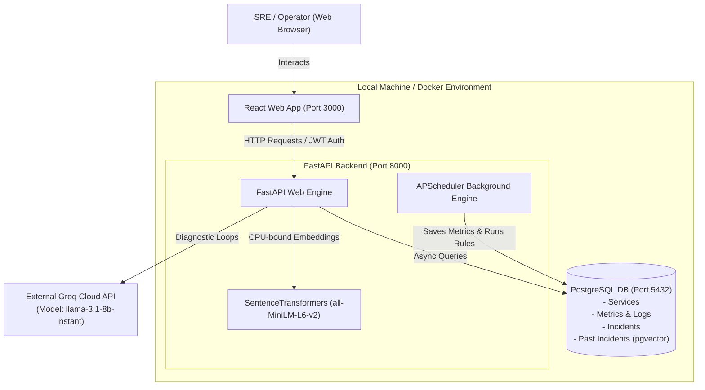
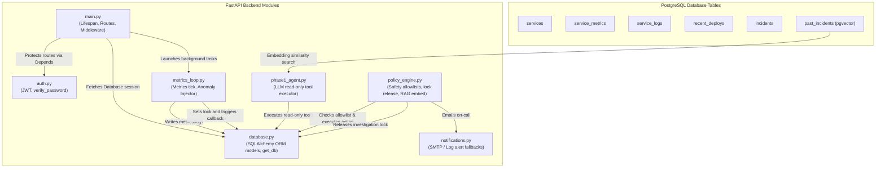
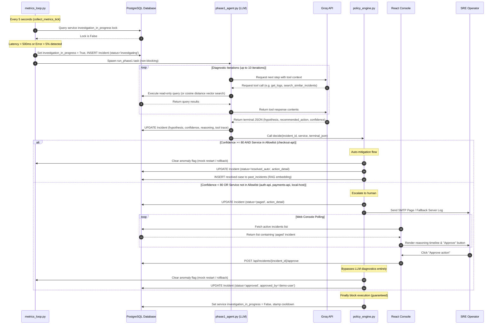
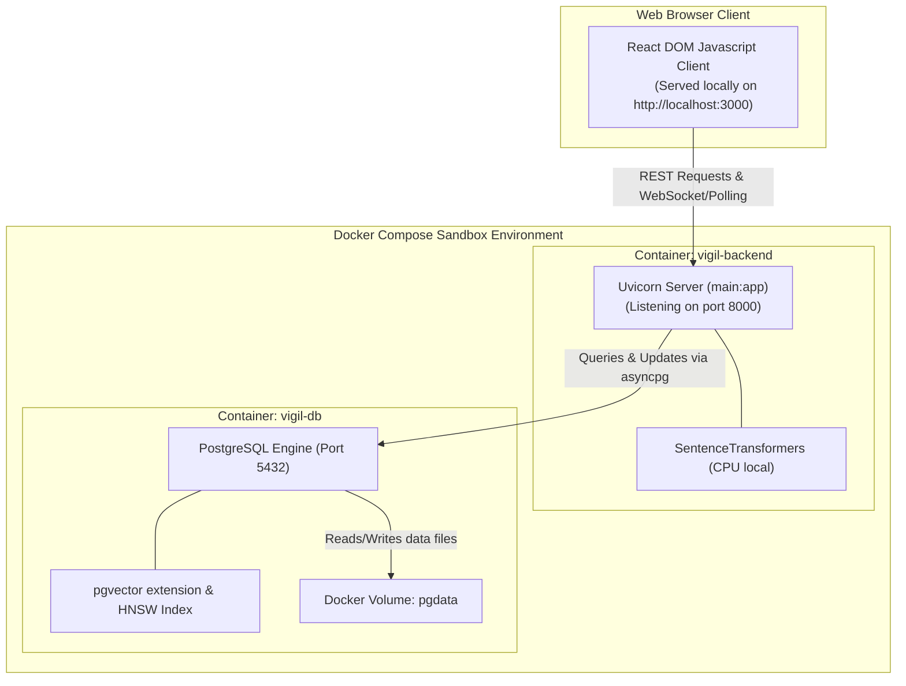

# Architecture Diagrams: Vigil Incident Response Agent

This document contains Mermaid diagrams mapping the actual structure and flow of the Vigil prototype codebase.

---

## 1. System Architecture Diagram
Shows the high-level boundaries between the user interface, backend application layers, database storage, and external AI providers.



---

## 2. Component Diagram
Shows how individual modules inside the Python backend interact with database tables.



---

## 3. Data Flow Diagram
Maps how metric and diagnostic data flow through the system.

```mermaid
graph TD
    Host["psutil Local Metrics"] -->|TickEvery 5s| MetricsLoop["metrics_loop.py"]
    Sim["Simulated Metrics Generator"] -->|TickEvery 5s| MetricsLoop
    
    MetricsLoop -->|INSERT| T_Met["service_metrics table"]
    MetricsLoop -->|INSERT| T_Log["service_logs table"]
    MetricsLoop -->|UPDATEhealth snapshot| T_Svc["services table"]
    
    MetricsLoop -->|Evaluate thresholds| Rules["Threshold Checker"]
    Rules -->|Breached & Unlocked| LockAcquire["Set investigation_in_progress=True"]
    LockAcquire -->|INSERT Incident| T_Inc["incidents table"]
    
    LockAcquire -->|Spawn Background Task| AgentPhase["phase1_agent.py (Phase 1)"]
    AgentPhase -->|Read diagnostic info| T_Met
    AgentPhase -->|Read diagnostic info| T_Log
    AgentPhase -->|Read diagnostic info| T_Dep["recent_deploys table"]
    AgentPhase -->|Read past cases| T_Past["past_incidents table"]
    
    AgentPhase -->|JSON report| SafetyGate["policy_engine.py (Phase 2)"]
    SafetyGate -->|Can Auto-Act| AutoAction["Execute Mock Action & Clear Anomaly"]
    AutoAction -->|UPDATE status=resolved_auto| T_Inc
    SafetyGate -->|Cannot Auto-Act| Escalation["SMTP Page & UPDATE status=paged"]
    Escalation -->|UPDATE status=paged| T_Inc
    
    UserApprove["Console human clicks Approve"] -->|POST /api/incidents/{id}/approve| ManualAction["Execute Mock Action & Clear Anomaly"]
    ManualAction -->|UPDATE status=approved| T_Inc
```

---

## 4. Sequence Diagram: Incident Investigation Flow
Tracks the operational sequence from anomaly detection to automated mitigation or human intervention.



---

## 5. Deployment Diagram
Illustrates how containers are grouped and exposed in the local running environment.


